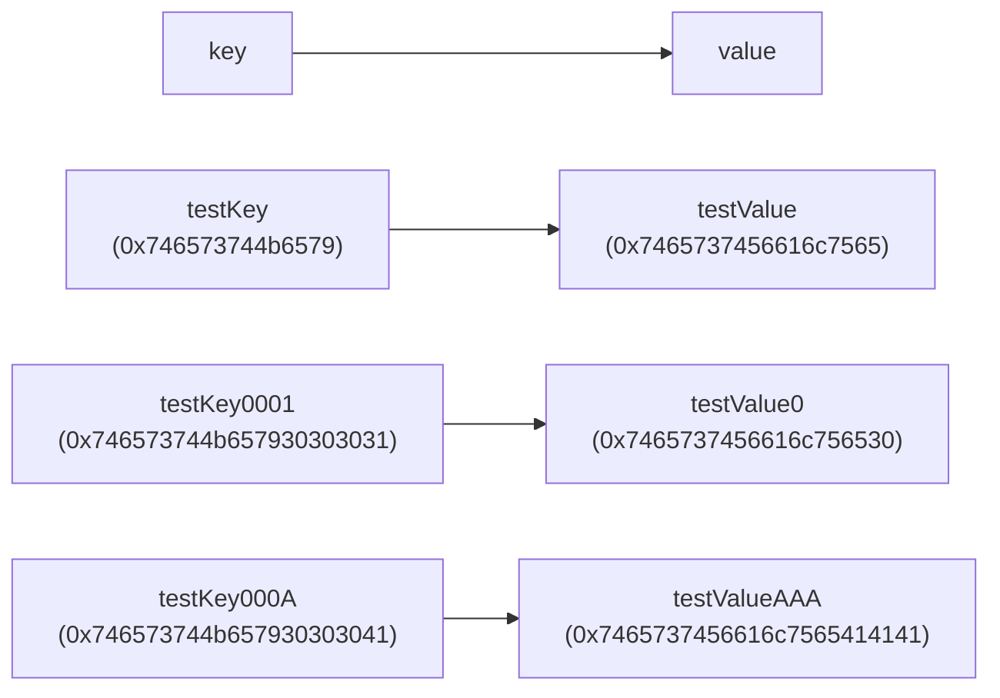
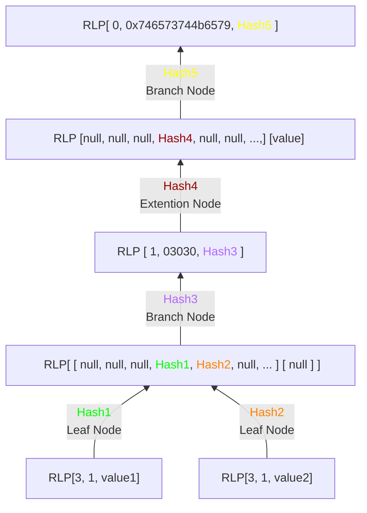

Referece: https://github.com/ethereumjs/ethereumjs-monorepo/tree/master/packages/mpt/examples/merkle_patricia_trees

Ref: https://github.com/bit-warrior/Read-LevelDB-Geth/blob/master/readLevelDB.js

RefL https://etherworld.co/2019/02/06/reading-ethereum-geth-database-leveldb/?utm_source=chatgpt.com

schema.go https://github.com/ethereum/go-ethereum/blob/v1.14.12/core/rawdb/schema.go
