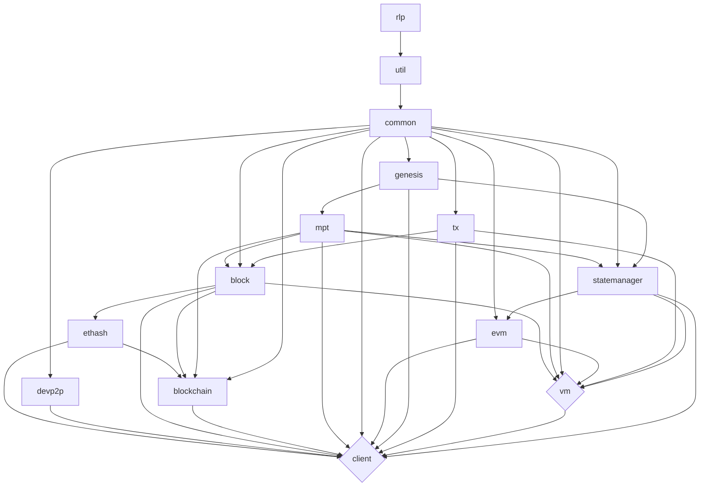

Referece: https://github.com/ethereumjs/ethereumjs-monorepo/tree/master/packages/mpt/examples/merkle_patricia_trees

```mermaid
 graph TD
   vm{vm}
   client{client}
   ethash --> blockchain
   ethash --> client
   devp2p --> client
   block --> client
   block --> blockchain
   block --> ethash
   block --> vm
   blockchain --> client
   mpt --> client
   mpt --> vm
   mpt --> blockchain
   mpt --> block
   mpt --> statemanager
   util --> common
   common --> block
   common --> statemanager
   common --> tx
   common --> blockchain
   common --> vm
   common --> evm
   common --> client
   common --> devp2p
   common --> genesis
   evm --> vm
   evm --> client
   genesis --> client
   genesis --> statemanager
   genesis --> mpt
   tx --> block
   tx --> vm
   tx --> client
   vm --> client
   rlp --> util
   statemanager --> evm
   statemanager --> vm
   statemanager --> client
```
